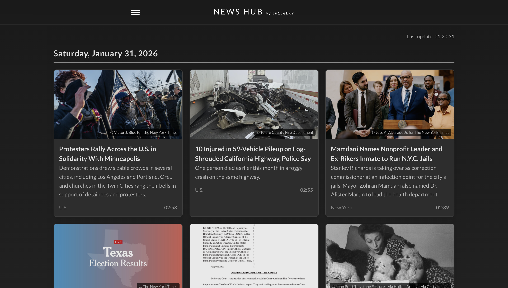

# News Hub

**[Live Demo](https://news-hub-eight-ruby.vercel.app)**




SPA-приложение для просмотра архива новостей New York Times.

## Стек

- **React 18** + **TypeScript**
- **Vite** — сборка и dev-сервер
- **React Router** — клиентская маршрутизация
- **React Query** — кэширование и управление серверным состоянием
- **Redux** — глобальное состояние
- **Framer Motion** — анимации
- **SCSS Modules** — стили

## Запуск локально

```bash
npm install
```

Создайте файл `.env` в корне проекта:

```
VITE_NYT_API_KEY=ваш_ключ
```

API-ключ можно получить бесплатно на [developer.nytimes.com](https://developer.nytimes.com/get-started) (Archive API).

```bash
npm run dev
```

## Деплой

Проект настроен для деплоя на **Vercel**. API-запросы проксируются через Vercel Rewrites (`vercel.json`), что решает проблему CORS.

В настройках проекта на Vercel добавьте переменную окружения `VITE_NYT_API_KEY`.

Каждый пуш в `main` автоматически запускает деплой.

## Структура проекта

```
src/
├── assets/fonts/       # Локальные шрифты (Lato)
├── components/
│   ├── card/           # Компоненты новостных карточек
│   ├── common/         # Общие компоненты (спиннер, ошибки)
│   └── header/         # Шапка с навигацией
├── constants/          # Конфигурация приложения
├── hooks/              # Кастомные хуки
├── services/           # Работа с API
├── styles/             # Глобальные стили
├── types/              # TypeScript типы
└── utils/              # Утилиты
```
